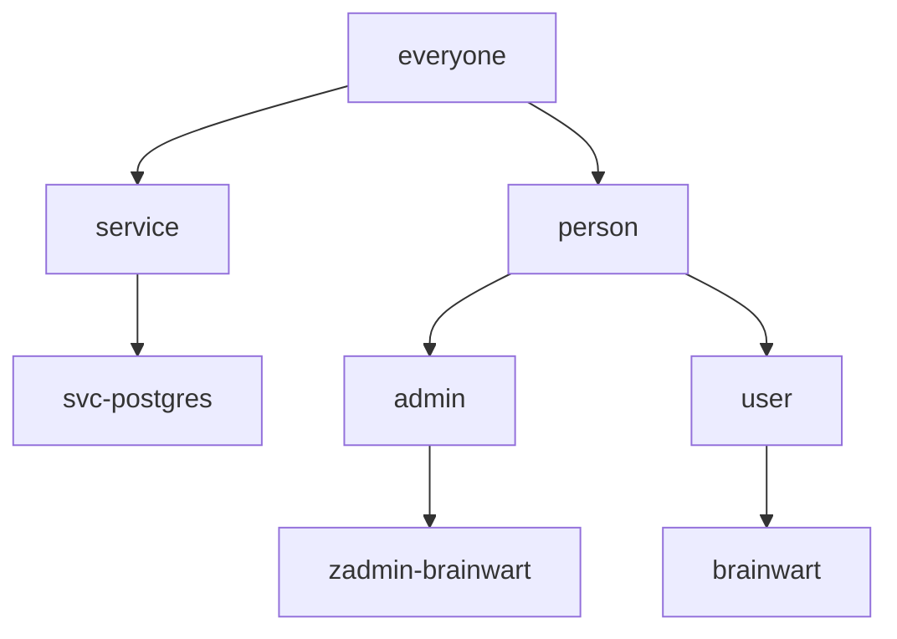

# auth-musings
Authorization and Authentication musings

# Tree based
- nodes can choose what control tags propagate to child nodes.
- parent nodes are groups
- nodes closer to root have less data access but, more identity management control

## Example User to Groups
<table>
<tr><th>User             <th>Groups
<tr><td>brainwart        <td>brainwart, user, person, everyone
<tr><td>zadmin-brainwart <td>zadmin-brainwart, admin, person, everyone
<tr><td>person           <td>person, everyone
<tr><td>svc-postgres     <td>svc-postgres, service, everyone
</table>

## Potential Data Table Shapes
<table>
<tr><th>Node      <th>Type
<tr><td>ID        <td>Guid
<tr><td>ParentID  <td>Guid
</table>

<table>
<tr><th>TagType  <th>Type
<tr><td>ID       <td>Guid
<tr><td>Name     <td>String
<tr><td>Type     <td>String
</table>

<table>
<tr><th>TagValue   <th>Type
<tr><td>ID         <td>Guid
<tr><td>NodeID     <td>Guid
<tr><td>TagTypeID  <td>Guid
<tr><td>Value      <td>String
</table>

## Potential Tag Types
<table>
<tr><th>ID <th>Name              <th>Type
<tr><td>-- <td>DataOIDC          <td>String
<tr><td>-- <td>Email             <td>String
<tr><td>-- <td>EnableImpersonate <td>Boolean
<tr><td>-- <td>EnableOIDC        <td>Boolean
<tr><td>-- <td>FullName          <td>String
<tr><td>-- <td>MachineName       <td>String
<tr><td>-- <td>UnixID            <td>int?
<tr><td>-- <td>Lock              <td>Boolean
<tr><td>-- <td>Hide              <td>Boolean
</table>

## Potential Module Areas
- Logging
  - Impersonation Module: "A as B did X"
- Authentication
  - Allow use of OIDC, Tokens, Password, or impersonation
- Start
  - Allow binding to custom ports for LDAPS
- Api Endpoint actions
  - Allow external scripting of modules
